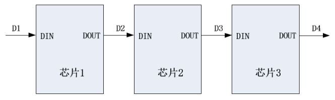
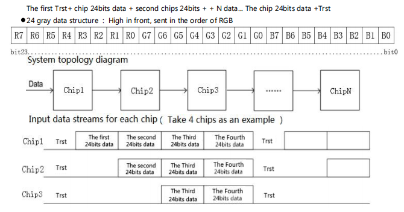

## 前言

RGB-LED级联芯片连接图如下：

每个芯片锁存 24bits 数据，对应一个 RGB 灯珠的 **8bits Red、8bits Green、8Bits Blue**

 

下图为码型输入格式：

一个通信应用实例如下图：

## 软件设计概述

首先，需要明确其码型时间，不同芯片的码型时间可能有差异，在本文芯片实用实例中，通过其芯片手册查得码型如下：

| 名称 | 描述 | 典型值 | 备注 |
|---|---|---|---|
| T | 时间周期 | 1200ns |  |
| T0H | 0码，高电平时间 | 300ns | 最小200ns，最大400ns |
| T0L | 0码，低电平时间 | 900ns | 最小800ns |
| T1H | 1码，高电平时间 | 900ns | 最小800ns，最大1000ns |
| T1L | 1码，低电平时间 | 300ns | 最小200ns |
| Trst | 复位码，低电平时间 | 200ns | 最小200ns |

在本芯片实例中，所应用国民技术N32L406芯片的 SPI2 外设时钟频率为 32MHz，分频配置为 4 分频，那么通过SPI2外设发送的数据Buffer的一个位的时间宽度就是 **1/(32/4 MHz) = 0.125 us = 125 ns**。

那么每设置一个灯珠 24bits 的RGB值，就需要 **24 * 1200ns / 125 ns = 230 bits** 的 SPI2 发送数据 Buffer

当然一个 bit 的时间周期也不一定限定在 1200 ns

## 外设配置初始化

## 灯效设置

## 参考站点

