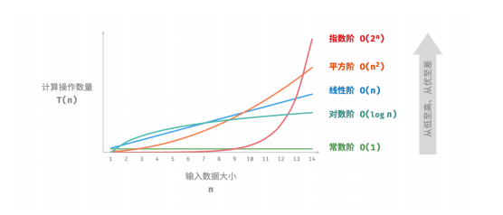

## 前言


## 复杂度分析

复杂度描述了随着输入数据大小的增加，算法执行所需时间和空间的增长趋势

“时间和空间资源”分别对应时间复杂度（time complexity）和空间复杂度（space complexity）。

复杂度反映了算法运行效率与输入数据体量之间的关系，关注的是随着数据输入量的变化，时间或空间增长的“快慢”

### 时间复杂度

时间复杂度表示**算法运行时间随着数据量变大时的增长趋势**，其能够有效评估算法的效率，当然也存着局限性，如下代码所示：算法 A 和 C 的时间复杂度相同，但实际运行时间差别很大
```c
// 算法 A 的时间复杂度：常数阶
void algorithm_A(int n) {
    printf("%d", 0);
}

// 算法 B 的时间复杂度：线性阶
void algorithm_B(int n) {
    for (int i = 0; i < n; i++) {
        printf("%d", 0);
    }
}

// 算法 C 的时间复杂度：常数阶
void algorithm_C(int n) {
    for (int i = 0; i < 1000000; i++) {
        printf("%d", 0);
    }
}
```

时间复杂度分析本质上是计算函数操作数量T(n)的渐近上界

如下函数：
```c
void algorithm(int n) {
    int a = 1; // +1
    a = a + 1; // +1
    a = a * 2; // +1
    
    // 循环 n 次
    for (int i = 0; i < n; i++) { // +1（每轮都执行 i ++）
        printf("%d", 0); // +1
    }
}
```
以上函数操作数量 `T(n) = 3 + 2n`，其是一次函数，说明运行时间的增长趋势是线性的，因此时间复杂度为线性阶

将线性阶的时间复杂度记为 𝑂(𝑛) ，这个数学符号称为大 𝑂 记号（big‑𝑂 notation），表示函数 𝑇(𝑛) 的渐近上界（asymptotic upper bound）
> 若存在正实数 𝑐 和实数 𝑛0 ，使得对于所有的 𝑛 > 𝑛0 ，均有 𝑇(𝑛) ≤ 𝑐 ⋅ 𝑓(𝑛) ，
> 则可认为 𝑓(𝑛) 给出了 𝑇(𝑛) 的一个渐近上界
> 记为 T(n) = O(f(n))

以下为渐近上界示例：忽略各种系数、常数项
| 操作数量 𝑇(𝑛) | 时间复杂度 𝑂(𝑓(𝑛)) |
| --- | --- |
| 100000 | 𝑂(1) |
| 3𝑛 + 2 | 𝑂(𝑛) |
| 2𝑛^2 + 3𝑛 + 2 | 𝑂(n^2) |
| n^3 + 10000𝑛² | 𝑂(n^3) |
| 2^n + 10000𝑛^10000 | 𝑂(2^n) |

**𝑂(1) < 𝑂(log 𝑛) < 𝑂(𝑛) < 𝑂(𝑛 log 𝑛) < 𝑂(𝑛^2) < 𝑂(2^n) < 𝑂(𝑛!)**
**常数阶 < 对数阶 < 线性阶 < 线性对数阶 < 平方阶 < 指数阶 < 阶乘阶**




#### 对数阶

对数阶常出现于基于分治策略的算法中，反映了“每轮缩减到一半”的情况。设输入数据大小为 𝑛 ，由于每轮缩减到一半，因此循环次数是 log2 𝑛 ，即 2^n 的反函数。

```c
/* 对数阶（循环实现） */
int logarithmic(int n) {
    int count = 0;
    
    while (n > 1) {
        n = n / 2;
        count++;
    }
    
    return count;
}

/* 对数阶（递归实现） */
int logRecur(int n) {
    if (n <= 1)
        return 0;
    
    return logRecur(n / 2) + 1;
}
```


#### 线性对数阶

线性对数阶常出现于嵌套循环中，两层循环的时间复杂度分别为 𝑂(log 𝑛) 和 𝑂(𝑛) 。相关代码如下：
```c
/* 线性对数阶 */
int linearLogRecur(int n) {
    if (n <= 1)
        return 1;

    int count = linearLogRecur(n / 2) + linearLogRecur(n / 2);
    
    for (int i = 0; i < n; i++) {
        count++;
    }
    
    return count;
}
```
主流排序算法的时间复杂度通常为 𝑂(𝑛 log 𝑛) ，例如快速排序、归并排序、堆排序等。


#### 最差、最佳、平均时间复杂度

通常平均时间复杂度可以体现算法在随机输入数据下的运行效率，用 Θ 记号来表示。可能由于 𝑂 符号过于朗朗上口，因此我们常常使用 𝑂 来表示平均时间复杂度


### 空间复杂度

通常只关注**最差空间复杂度**

算法在运行过程中使用的内存空间包括：输入数据、暂存空间、输出数据。暂存空间包括有：暂存数据、栈帧空间、指令空间

在分析空间复杂度时，通常统计**暂存数据、栈帧空间、输出数据**三部分，其它忽略，示例如下：
```c
/* 函数 */
int func() {
    // 执行某些操作...
    return 0;
}
int algorithm(int n) { // 输入数据
    const int a = 0; // 暂存数据（常量）
    int b = 0; // 暂存数据（变量）
    int c = func(); // 栈帧空间（调用函数）
    
    return a + b + c; // 输出数据
}
```

空间复杂度推算示例代码如下：
```c
int func() {
    // 执行某些操作
    return 0;
}

/* 每轮中的 function() 都返回并释放了栈帧空间，其空间复杂度为 𝑂(1) */
void loop(int n) {
        for (int i = 0; i < n; i++) {
        func();
    }
}

/* 递归函数 recur() 在运行过程中会同时存在 𝑛 个未返回的 recur() ，占用 𝑂(𝑛) 的栈帧空间 */
void recur(int n) {
    if (n == 1) return;
    
    return recur(n - 1);
}
```

最差空间复杂度的“最差”推算示例代码如下：其最差空间复杂度为为 O(n)
- 以最差输入数据为准：当 n<=10 时，空间复杂度为 O(1)当 ，n>10 时，空间复杂度为 O(n)
- 以运行中的峰值内存为准：程序执行到最后一行时，内存占用为 O(1)。但在初始化并应用数组中，占用空间为 O(n)。
```c
void algorithm(int n) {
    int a = 0; // O(1)
    int b[10000]; // O(1)
    if (n > 10)
        int nums[n] = {0}; // O(n)
}
```


𝑂(1) < 𝑂(log 𝑛) < 𝑂(𝑛) < 𝑂(𝑛2) < 𝑂(2𝑛)

常数阶 < 对数阶 < 线性阶 < 平方阶 < 指数阶

- 常数阶：常见于数量与输入数据大小 𝑛 无关的常量、变量、对象；另外在循环中初始化的与n无关变量并退出当前循环即释放的内存，空间复杂度仍为 O(1)
- 线性阶：常见于元素数量与n成正比的数组、链表、栈、队列等
- 平方阶：常见于矩阵和图，元素数量与n成平方关系
- 指数阶：常见于二叉树
- 对数阶：常见于分治算法，

### 小结

降低时间复杂度通常需要以提升空间复杂度为代价，反之亦然。

在大多数情况下，时间比空间更宝贵，因此“以空间换时间”通常是更常用的策略。当然，在数据量很大的情况下，控制空间复杂度也非常重要。

## 数据结构

常见的数据结构包括数组、链表、栈、队列、哈希表、树、堆、图，它们可以从 **“逻辑结构”和“物理结构”** 两个维度进行分类


## 排序算法

### 插入排序

```c
/* 插入排序 */
void insertionSort(int nums[], int size) {
    // 外循环：已排序区间为 [0, i-1]
    for (int i = 1; i < size; i++) {
        int base = nums[i], j = i - 1;
        // 内循环：将 base 插入到已排序区间 [0, i-1] 中的正确位置
        while (j >= 0 && nums[j] > base) {
            // 将 nums[j] 向右移动一位
            nums[j + 1] = nums[j];
            j--;
        }
        // 将 base 赋值到正确位置
        nums[j + 1] = base;
    }
}

/* Driver Code */
int main() {
    int nums[] = {4, 1, 3, 1, 5, 2};
    insertionSort(nums, 6);
    printf("插入排序完成后 nums = ");
    for (int i = 0; i < 6; i++) {
        printf("%d ", nums[i]);
    }
    printf("\n");

    return 0;
}
```

### 快速排序

**思想：** 基于分治策略，选择数组中的某个元素作为基准数，将一个较长的数组分成两个较短的子数组，满足：“左子数组任意元素 ≤ 基准数 ≤ 右子数组任意元素”。而后再对子数组进行相同的操作，直到数组中的元素个数为1，此时数组已排序。

**算法流程：** 
1. 选取数组最左端元素作为基准数，初始化两个指针 i 和 j 分别指向数组的两端。
2. 设置一个循环，在每轮中使用 i（j）分别寻找第一个比基准数大（小）的元素，然后交换这两个元素。
3. 循环执行步骤 2. ，直到 i 和 j 相遇时停止，最后将基准数交换至两个子数组的分界线。

```c
/* 元素交换 */
void swap(int nums[], int i, int j) {
    int tmp = nums[i];
    nums[i] = nums[j];
    nums[j] = tmp;
}
/* 哨兵划分 */
int partition(int nums[], int left, int right) {
    // 以 nums[left] 为基准数
    int i = left, j = right;
    while (i < j) {
        while (i < j && nums[j] >= nums[left]) {
        j--; // 从右向左找首个小于基准数的元素
        }
    
        while (i < j && nums[i] <= nums[left]) {
            i++; // 从左向右找首个大于基准数的元素
        }
        
        // 交换这两个元素
        swap(nums, i, j);
    }
    
    // 将基准数交换至两子数组的分界线
    swap(nums, i, left);
    
    // 返回基准数的索引
    return i;
}

void quickSort(int nums[], int left, int right) {
    
    // 子数组长度为 1 时终止递归
    if (left >= right) {
        return;
    }
    
    // 哨兵划分
    int pivot = partition(nums, left, right);
    
    // 递归左子数组、右子数组
    quickSort(nums, left, pivot - 1);
    quickSort(nums, pivot + 1, right);
}
```

**优化：** 可以在数组中选取三个候选元素（通常为数组的首、尾、中点元素），并将这三个候选元素的中位数作为基准数


### 归并排序

归并排序（merge sort）是一种基于分治策略的排序算法

1. 划分阶段：通过递归不断地将数组从中点处分开，将长数组的排序问题转换为短数组的排序问题。
2. 合并阶段：当子数组长度为 1 时终止划分，开始合并，持续地将左右两个较短的有序数组合并为一个较长的有序数组，直至结束。


## 参考站点


- [hello， 算法](https://github.com/krahets/hello-algo)

