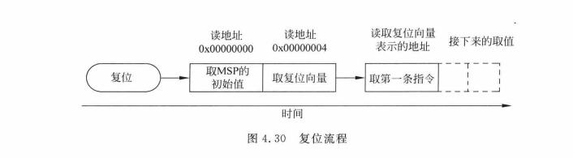

## 概述

无论是Keil还是Gcc，对于应用了Cortex-M内核的 xx32 单片机，其从Flash启动流程都是从 0x8000000 取栈顶地址存至MSP，而后执行复位中断`Reset_Handler()`，在复位中断内执行 系统时钟初始化、将可读可写数据从 Flash 搬运到 SRAM、清零 SRAM 的 bss 段数据等，最后跳转至`main()`函数。
<br>

当然，芯片为何会从 0x8000000 开始执行，或者说芯片内部的出厂固化的ROM程序是如何执行的，此处暂不过多赘述，详见下文章节。
<br>

从源文件分析来看，Keil环境下的启动初始化源代码大多集成在库里面，用户不可见，因此本文主要从gcc环境下的源文件进行详细剖析启动流程。
<br>

另外，Keil下有所谓的`$$Super$main`/`$$Sub$main`，或者说gcc环境下.s源码最后是跳转至`main`/`entry`函数，此等都可由用户配置写就，暂不作讲解。
<br>


## Keil环境下的启动文件分析

### 初始化栈顶指针

内核从0x0800 0000读取栈顶地址，并将该地址存入MSP中。
- 栈顶地址的值为0x2000 xxxx，工程所生成bin文件的前四个字节即为栈顶地址。（.s 启动文件中说明了程序的第一个字就是`__initial_sp`栈顶地址，第二个字是`Reset_Handler`地址）
- 从0x2000 0000到0x2000 xxxx即为程序所运行的范围，该段内存分布为：RW段、ZI段：其中RW段为可读写的非0数据段，ZI段包括了0数据段、堆区、栈区。
<br>

从0x08000004取出复位中断函数`Reset_Handler`地址，装载至PC指针，跳转执行
<br>

### 复位中断

**Keil环境代码如下：**
- 先进行系统时钟初始化
  >SystemInit()函数定义在system_xxx.c中，主要为初始化系统时钟RCC、重定位中断向量表
- 跳转至_main()

```
; Reset handler
Reset_Handler   PROC
                EXPORT  Reset_Handler             [WEAK]  
                IMPORT  __main
                IMPORT  SystemInit
                LDR     R0, =SystemInit   
                BLX     R0               
                LDR     R0, =__main
                BX      R0    
                ENDP
```

### _main()函数

`__scatterload`
- 将初始化的可读写数据段拷贝从Flash拷贝到SRAM
- 初始化清零未初始化数据段
<br>

`__rt_entry`
- 负责初始化堆栈，完成库函数的初始化，
- 最后跳转至main()函数
<br>


## GCC编译环境下的启动文件分析

**程序跳转至复位中断后，执行以下操作：**
- 将初始化的可读写数据段拷贝从Flash拷贝到SRAM
- 初始化清零未初始化数据段
- 调用系统时钟初始化函数（SystemInit）
- 调用静态构造函数（__libc_init_array） ——参考自CHATGPT
  - 调用所有静态构造函数->调用.preinit_array段中的所有函数指针->调用.init段中的_init函数->调用.init_array段中的所有函数指针->确保在程序执行主函数 main 之前，所有需要初始化的内容都已经完成。
  - 当然，纯C语言部分不会实际调用到相关构造函数
  - 其在链接脚本中有体现：
  ```
  .preinit_array     :
  {
    PROVIDE_HIDDEN (__preinit_array_start = .);
    KEEP (*(.preinit_array*))
    PROVIDE_HIDDEN (__preinit_array_end = .);
  } >FLASH
  .init_array :
  {
    PROVIDE_HIDDEN (__init_array_start = .);
    KEEP (*(SORT(.init_array.*)))
    KEEP (*(.init_array*))
    PROVIDE_HIDDEN (__init_array_end = .);
  } >FLASH
  ```
  - 链接脚本中，可将用户函数指定链接到相应的init段，从而实现在main前的函数自动初始化？
- 进入用户函数(main)<br>


---

**复位中断代码如下所示，注意：其中所用变量_sidata、_edata等等须 搭配链接脚本内容 共同参阅**

### 复位中断起始

```
Reset_Handler:  
  /* 将寄存器r1清零，作为数据段复制的偏移量 */
  movs  r1, #0              
  
  /* 无条件跳转到LoopCopyDataInit标签处 */
  b  LoopCopyDataInit       
```

### 拷贝RW-Data

```
// 实际的RW-Data拷贝工作
CopyDataInit:
  ldr  r3, =_sidata         /* 将_sidata的地址加载到寄存器r3，表示初始化数据段的起始地址 */
  ldr  r3, [r3, r1]         /* 从初始化数据段中取出一个32位数据，存储在寄存器r3中。 */
  str  r3, [r0, r1]         /* 将寄存器r3中的数据存储到数据段当前位置。 */
  adds  r1, r1, #4         /* 增加偏移量，移动到下一个32位数据的位置。 */


// 计算判断是否完成拷贝工作，未完成则继续拷贝，完成则跳转至清零ZI-Data部分
LoopCopyDataInit:
  ldr  r0, =_sdata         /* 将_sdata的地址加载到寄存器r0，表示数据段的起始地址。*/
  ldr  r3, =_edata         /* 将_edata的地址加载到寄存器r3，表示数据段的结束地址。 */
  adds  r2, r0, r1         /* 计算数据段当前位置的地址，存储在寄存器r2中。*/
  cmp  r2, r3         /* 比较当前位置与数据段结束地址的大小关系 */
  bcc  CopyDataInit         /* 如果当前位置小于结束地址，则跳转到CopyDataInit标签处 */
```

### 清零bss段

```
// 清零未初始化数据段（bss segment）
  ldr  r2, =_sbss         /* 将_sbss的地址加载到寄存器r2，表示未初始化数据段的起始地址 */
  b  LoopFillZerobss         /* 无条件跳转到LoopFillZerobss标签处 */
FillZerobss:
  movs  r3, #0      /* 将寄存器r3清零，作为未初始化数据段的填充值 */
  str  r3, [r2], #4      /* 将寄存器r3中的数据存储到当前位置，并将当前位置向后移动4个字节 */
    
// 判断是否完成清零工作，是则跳转至系统时钟初始化部分
LoopFillZerobss:         
  ldr  r3, = _ebss        /* 将_ebss的地址加载到寄存器r3，表示未初始化数据段的结束地址 */
  cmp  r2, r3         /* 比较当前位置与结束地址的大小关系 */
  bcc  FillZerobss         /* 如果当前位置小于结束地址，则跳转到FillZerobss标签处 */
```

### 其它初始化及跳转至main

```
  /* 调用系统时钟初始化函数 */
  bl  SystemInit     
  
  /* 调用静态构造函数 */       
  bl __libc_init_array         
  
  /* 应用程序的入口函数 */
  bl  main           
  
  /* 通过bx lr指令返回到Reset（通常是启动代码的入口处），当然不会执行到此处 */ 
  bx  lr            
```

### GCC环境之复位中断源码总览

```
Reset_Handler:  
  movs  r1, #0              /* 将寄存器r1清零，作为数据段复制的偏移量 */
  b  LoopCopyDataInit       /* 无条件跳转到LoopCopyDataInit标签处 */

CopyDataInit:
  ldr  r3, =_sidata         /* 将_sidata的地址加载到寄存器r3，表示初始化数据段的起始地址 */
  ldr  r3, [r3, r1]         /* 从初始化数据段中取出一个32位数据，存储在寄存器r3中。 */
  str  r3, [r0, r1]         /* 将寄存器r3中的数据存储到数据段当前位置。 */
  adds  r1, r1, #4         /* 增加偏移量，移动到下一个32位数据的位置。 */
    
LoopCopyDataInit:
  ldr  r0, =_sdata         /* 将_sdata的地址加载到寄存器r0，表示数据段的起始地址。*/
  ldr  r3, =_edata         /* 将_edata的地址加载到寄存器r3，表示数据段的结束地址。 */
  adds  r2, r0, r1         /* 计算数据段当前位置的地址，存储在寄存器r2中。*/
  cmp  r2, r3         /* 比较当前位置与数据段结束地址的大小关系 */
  bcc  CopyDataInit         /* 如果当前位置小于结束地址，则跳转到CopyDataInit标签处 */
  
  /*清零未初始化数据段（bss segment）*/
  ldr  r2, =_sbss         /* 将_sbss的地址加载到寄存器r2，表示未初始化数据段的起始地址 */
  b  LoopFillZerobss         /* 无条件跳转到LoopFillZerobss标签处 */
FillZerobss:
  movs  r3, #0      /* 将寄存器r3清零，作为未初始化数据段的填充值 */
  str  r3, [r2], #4      /* 将寄存器r3中的数据存储到当前位置，并将当前位置向后移动4个字节 */
    
LoopFillZerobss:         
  ldr  r3, = _ebss        /* 将_ebss的地址加载到寄存器r3，表示未初始化数据段的结束地址 */
  cmp  r2, r3         /* 比较当前位置与结束地址的大小关系 */
  bcc  FillZerobss         /* 如果当前位置小于结束地址，则跳转到FillZerobss标签处 */

  bl  SystemInit            /* 调用系统时钟初始化函数 */
  bl __libc_init_array         /* 调用静态构造函数 */
  bl  main            /* 应用程序的入口函数 */
  bx  lr            /* 通过bx lr指令返回到调用者（通常是启动代码的入口处），当然不会执行到此处 */
.size  Reset_Handler, .-Reset_Handler
```


## 常见疑惑解答

### 为什么芯片启动时会将栈顶地址存放到 MSP，然后跳转至复位中断执行？

.s 启动文件和链接脚本已经讲明了所生成的映像文件第一个字是栈顶地址，第二个字就是复位中断的地址。

有些人可能会疑惑，为什么系统启动会设置栈顶地址，并且会跳转到复位中断呢？（其实，这都是 Cortex-M 内核所实现的）

以下内容摘选自`ARM Cortex-M3与Cortex-M4权威指南`的第4.8节：`复位和复位流程`
```
在复位后以及处理器开始执行程序前，Cortex-M处理器会从存储器中读出头两个字，如图4.30所示。
向量表位于存储器的开头部分，它的头两个字为主栈指针(MSP)的初始值，以及代表复位处理起始地址的复位向量(参考本书图4.26和4.5.3节)。
处理器读出这两个字后，就会将这些数值赋给MSP和程序计数器(PC)。
```


由此可见，所谓的启动文件和链接脚本 都是根据 内核特性和单片机厂商的设计特性 而制定的，前者是果，后者是因。

### 芯片启动时为何都是从 0x8000000 开始？

Cortex-M 内核复位都是固定从 0x00000000 开始，而在 STM32/xx32 中，程序通常存储在 0x8000000 地址并在此开始执行，这一点是由于芯片厂商的设计所决定的。

以下内容摘选自互联网：

在 STM32 等微控制器中，可以通过配置 BOOT 引脚或其他方式，将 Flash 的 0x08000000 地址重映射到 0x00000000。

这样，微控制器就可以在 0x00000000 地址处找到中断向量表，同时，程序代码仍然存储在 Flash 的0x08000000 地址处

这种设计使得微控制器能够在启动时正确地找到并执行存储在 Flash 中的程序，同时还能满足 ARM Cortex-M 系列微控制器的启动要求

### 通过 ISP 编程或者 SWD/JTAG 下载方式时，芯片是如何工作的？

在系统编程：毫无疑问，芯片内部是内置固化了一段出厂bootloader程序的，此程序用于实现串口升级，但是用户是不知道其源码实现的

在电路编程，使用SWD/JTAG接口

- [如何使用串口来给STM32下载程序](https://zhuanlan.zhihu.com/p/59866951#%E6%80%BB%E7%BB%93)


## 参考站点

- [ARM Cortex-M3与Cortex-M4权威指南](https://bbs.21dianyuan.com/forum.php?mod=viewthread&tid=302606)
- [STM32的Flash地址是0x08000000，从0x00000000不可以？](https://blog.csdn.net/weixin_42231514/article/details/106178653)
