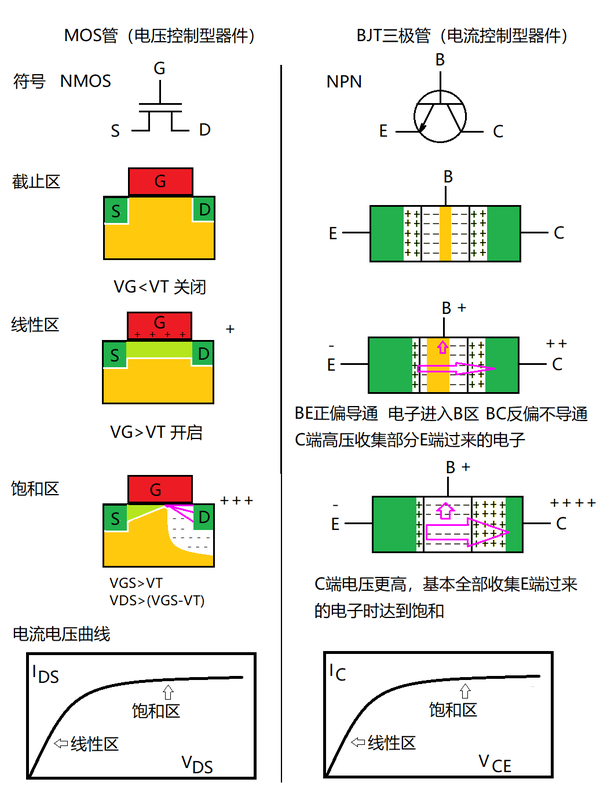

**未完待续...**

---

## 前言

本文并非专于器件相关概念，仅于工作时接触到或者兴致到来时，随手记录而已

## 电路基础元件概念

电阻：R
电感：L
电容：C

### 二极管

简写为：D

二极管的主要功能包括整流（将交流电转换为直流电）、稳压、钳位、开关和频率选择等。

在电路中，二极管通常用于保护电路免受反向电压的影响，使得电流在一个方向流动，即所谓的单向导电性。

其基本原理是基于P型半导体和N型半导体形成的P-N结：
1. P-N结的形成：P型半导体含有较多的空穴（正电荷载流子），而N型半导体含有较多的电子（负电荷载流子）。当P型和N型半导体接触时，电子从N型材料向P型材料移动，空穴从P型材料向N型材料移动，形成一个叫做空间电荷区的区域，也称为耗尽层
2. 电平衡：耗尽层两侧的电荷分布产生一个自建电场，阻止更多的电子和空穴继续穿越P-N结，使得扩散电流与漂移电流达到平衡，二极管处于截止状态
3. 正向偏置：当在P端施加正电压（阳极），在N端施加负电压（阴极）时，P-N结正向偏置。当正向电压达到一定阈值（正向导通电压，通常为0.6V到0.7V左右对于硅二极管）克服自建电场，空间电荷区变窄，允许大量的电子和空穴再次流动，形成较大的正向电流
4. 反向偏置：当在P端施加负电压，N端施加正电压时，P-N结反向偏置。反向电压增强自建电场，空间电荷区扩大，只有少量的反向漏电流（I0）通过，通常很小，二极管基本上截止
5. 击穿：如果反向电压过高，P-N结可能会发生雪崩击穿或齐纳击穿，导致电流突然大幅度增加，击穿后，二极管可能失去单向导电性，变为导通状态。

注意压降的影响，导致电压的降低或者功率损耗

### 三极管（双极型晶体管）

三极管由三层半导体材料组成，分别是发射极（Emitter, E）、基极（Base, B）和集电极（Collector, C）。发射极和集电极之间通过基极连接。

三极管分为两种类型，NPN型和PNP型，区别在于它们的掺杂类型和电流方向：

NPN型：发射极和集电极是N型半导体，基极是P型半导体。**电流主要是电子流，电子从发射极向集电极流动（即电流为集电极流向发射极）**。简写为 Q 或 QN，在开关电路、放大电路、数字逻辑电路以及各种电子设备的接口驱动等方面更为常见。

PNP型：发射极和集电极是P型半导体，基极是N型半导体。**电流主要是空穴流，电流方向与NPN型相反**。简写为 Q 或 QP，更多出现在需要与负电源配合、需要电流反向传输、需要与NPN型晶体管互补工作的场合，如某些电源控制电路、模拟电路的反相级、推挽放大器以及某些特殊的逻辑电路中。

**放大作用：** 将三极管的基极连接到控制DAC引脚，可以实现所需的放大作用。也可以串联一个电容接到PWM-IO，通过方波占空比控制电容的电压，从而驱动基极。
**开关作用：** 将三极管的基极连接到控制IO口，可以实现开关作用。通常需要串联电阻，当然硬件上一般采用**数字三极管**，里面已经集成了串联电阻。

截止状态：当基极-发射极之间的电压为零或反向偏置时，三极管处于截止状态，几乎没有电流流过
对于NPN型，Vb < Ve，集电极电流Ic接近于零。
对于PNP型，Vb > Ve，集电极电流Ic接近于零。

放大状态：当基极-发射极之间的电压足够大，使得发射极的多数载流子大量注入基极区，并被集电区收集时，三极管处于饱和状态，集电极电流达到最大
对于NPN型，Vc > Vb > Ve，基极电流Ib控制Ic，Ic与Ib之间的关系是放大关系。
对于PNP型，Vc < Vb < Ve，同样存在放大关系。

饱和状态：
对于NPN型，Vb > Ve，Vc不再随着Vb的增加而增加，Ic达到最大值。
对于PNP型，Vb < Ve，Vc不再随着Vb的减小而减小，Ic也达到最大值。

### MOS管（场效应晶体管）

MOSFET（金属-氧化物-半导体场效应晶体管）的工作原理基于电场对半导体表面通道的控制。MOSFET有三个电极：栅极（Gate）、源极（Source）和漏极（Drain），以及一个衬底

NMOS和PMOS的区别在于沟道类型和控制电流的载流子类型，**对于NMOS，载流子是电子，对于PMOS，载流子是空穴对**

当栅极G与源级S之间的电压足够大时，衬底中的少子会聚集到衬底与栅极G绝缘层的边界，形成源级S和漏级D之间的导电沟道。载流子可以通过这个沟道从源级S流向漏级D。此时栅源GS之间的电压就是阈值电压，记作Vth。通常为0.8V以上。

VGS为栅极-源极电压，即VGS = Vg - Vs

**N沟道MOSFET：（NMOS管）** *VGS>阈值电压（Vth）时，导通；VGS<=阈值电压（Vth）时，截止*。用于控制近地端的开关，如CJ3400，此时S极接负极
**P沟道MOSFET：（PMOS管）** *VGS<阈值电压（Vth）时，导通；VGS>=阈值电压（Vth）时，截止*。用于控制近源端的开关，如CJ3401，此时S极接正极

VGS绝对值越大，MOSFET的导通程度越强，导通电阻越小，漏极电流越大。当MOSFET进入深度饱和区后，漏极电流的增加速率会放缓，最终达到一个饱和点。

另外，MOS管的电流方向是双向的。但通常情况下，NMOS的电流流向为 D->S。栅极-源极电压起到控制通断作用。
> 由于衬底和D、S的掺杂导致的NMOS存在方向为S->D的体效应二极管
> 如果把S接高位电压，D接低位电压，此时NMOS相当于导通二极管，但此时栅极就失去了控制作用，没有意义了
> PMOS管同理，电流流向通常为 S->D

在实际应用中，一般在栅极和源极之间串个100K电阻，提供电压偏置、抑制振荡等。通过程序控制栅极的电压变化，与硬件电路确定的源极电压，从而控制MOS导通或截止。栅极的电压要能够控制实现大于或小于源极电压。

### TVS管

### 晶振（XTAL）

不起振的原因

### 集成电路（IC）

数字IC：

模拟IC：

混合信号集成电路：音频解码器

## PCB设计中的基础器件/模块/电路

### 充电、稳压器件

稳压器（线性稳压器、开关稳压器）：将输入电压稳定到所需的输出电压。线性稳压器和开关稳压器都可以以独立元件的形式存在，也可以集成在IC之中

升压电路、降压电路或者升降压型电路等都是属于稳压器件的范畴。

Boost（升压）：将输入电压升高到所需的输出电压

Buck（降压）：将输入电压降低到所需的输出电压

DC-DC转换器：包括Boost、Buck和Buck-Boost（升降压）、反相等，具有高效率、高输出电流、较低静态电流等特点，但同时开关噪音大、成本高。现在通常都把开关型稳压器称作DC-DC，把低压差线性稳定器单独地称作LDO。

LDO（低压降线性稳压器）：不使用开关器件，成本低、噪音低，静态电流小，外接元件少。
> 适用于输入电压和输出电压很接近的场景，如3.7V锂电池到3.3V负载，从原理可知LDO的输入电流基本上等于输出电流，所以压降越大，效率越低。

 

SGM62112-ADJ、SGM61020

线性稳压器通常由分立元件（如晶体管、电阻、电容）组成，也有集成化的线性稳压器IC（如LM7805、LM317等），它们将所有必要的功能集成在一个封装内，简化了电路设计和组装

---

充电模块：当施加到电池的外界电压大于电池电压时，则外界向电池充电

开关型充电器：通常高频开关操作（可以说是PWM调制），将输入电压稳定到一个给电池充电的输出电压，大幅度提升效率、减少热损耗，宽范围输入

线性充电器：基于使用一个或多个晶体管作为可变电阻来调节流向电池的充电电流。效率低、损耗大、低噪声、体积小

通常原理图布置在电源模块上可以预留并多几路 RC串联的NC电路，后续EMC时可以进行调节

SGM40661 过流保护
SGM41524YTDC8G

### 功率放大器

功放可以是集成IC（集成电路），也可以是基于分立元件（如晶体管、电子管）构建的。
集成IC功放，是将放大电路中的多个元件，如晶体管、电阻、电容等，集成在同一块硅片上，形成一个完整的放大器电路。
 

A类功放（甲类功放）：
- A类功放的输出晶体管在整个信号周期内始终处于导电状态，即使在没有音频信号输入时，也会有恒定的电流流过输出级，这保证了极低的失真，但效率很低，因为大部分能量转化为热量。
- 优点：音质纯净，失真低。
- 缺点：效率低（一般小于50%），发热严重，需要大型散热器
 

B类功放（乙类功放）：
- B类功放的输出晶体管仅在信号的半个周期内导通，分别处理正半周和负半周信号，从而提高了效率，但存在交越失真问题，即在信号过零点附近两个晶体管切换时产生的非线性失真。
- 优点：效率较高（约为78%）。
- 缺点：存在交越失真，音质不如A类。
 

AB类功放（甲乙类功放）：
- AB类功放是A类和B类的折衷方案，通过轻微偏置输出晶体管，使其在没有信号时仍有一点导通，减少了B类功放的交越失真，同时保持了较高的效率。
- 优点：结合了A类的音质和B类的效率，失真低，效率比A类高。
- 缺点：相比B类功放，效率略低，发热仍较明显。
 

D类功放（丁类功放）：
- D类功放是一种开关放大器，它将音频信号转换为高频脉冲序列，通过晶体管快速开关来控制输出，效率极高（可达90%以上）。
- 其**信号在输出级被调制成PWM（脉冲宽度调制）或PFM（脉冲频率调制）信号。**
- 优点：极高效率，发热少，体积小，适合便携式应用。
- 缺点：需要额外的滤波器来恢复原始音频信号，对电源和地线噪声敏感，可能影响音质。
 

## 其它在PCB设计中的基础器件

连接器（CN或CONN）：板对板、线对板、FPC/FFC连接器

电位器

编码器

### 传感器

### 保护与控制元件

熔断器、保险丝

热敏开关、过温保护器

压敏电阻

### EMC相关设计

屏蔽罩

磁珠

共模电感

滤波电容

## 注意点及扩展思考

在器件选型时，一定要详细查看规格书，当然也可以查看下IC模块内的组成

## 参考站点

- [一篇文章说清楚TVS管](https://mp.weixin.qq.com/s/XhCeTT007Is_M5pU00NaeQ)
- [实用角度解读MOS管：功能特点与实际应用](https://mp.weixin.qq.com/s/l7-WHBXccLOAm4gO4N8_Bw)
- [三极管的奥秘：如何用小电流控制大电流](https://mp.weixin.qq.com/s/R47HmGaQAvFPwFJ9f5dGCw)
- [“晶振”工作原理及匹配电容如何选你get到了吗](https://mp.weixin.qq.com/s/9Kf1bLaXQgGTXwK63m5jwg)

